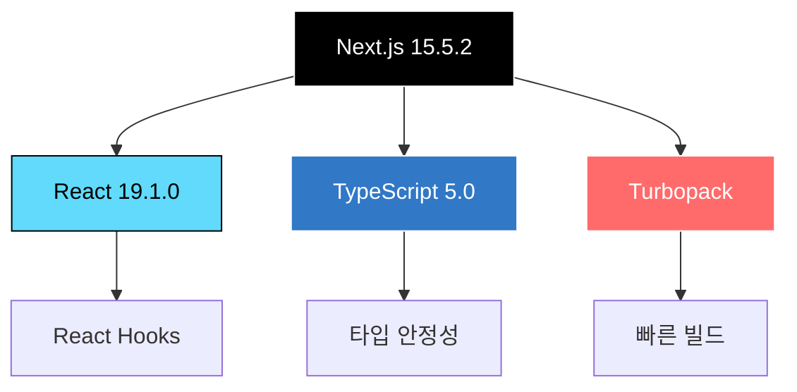
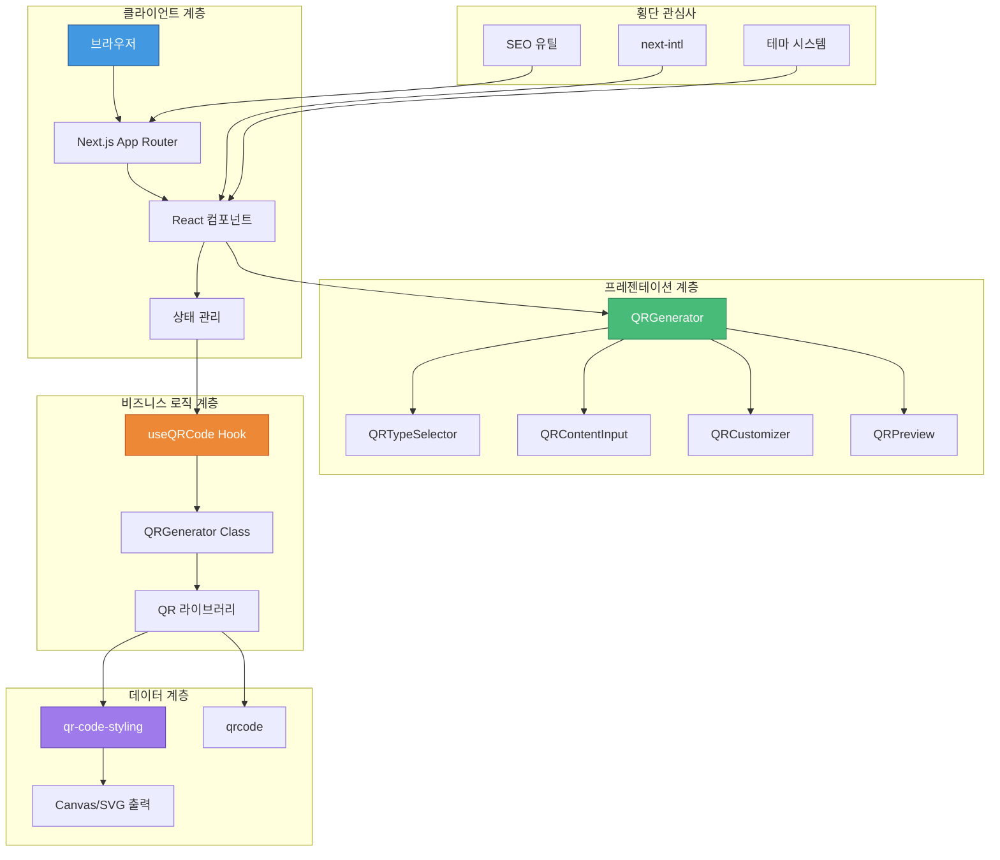
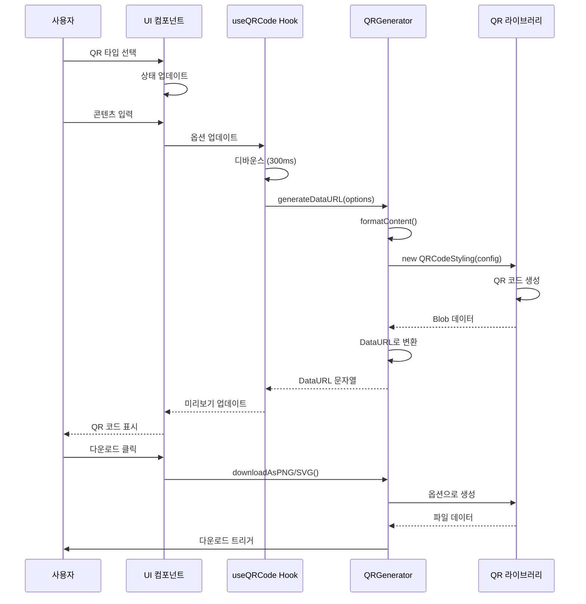
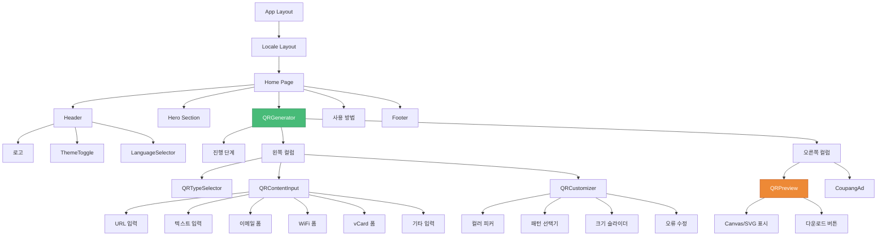
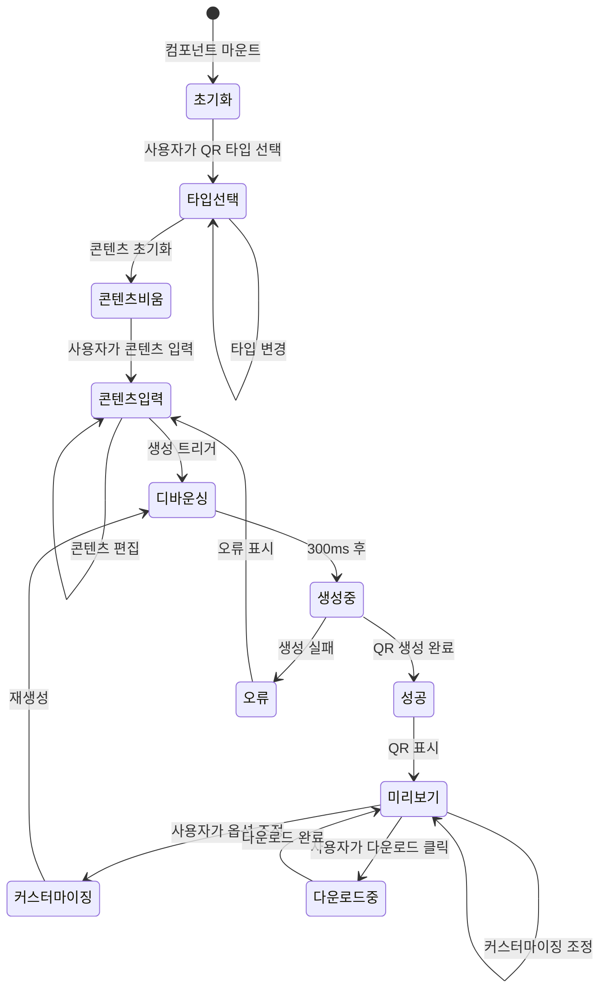
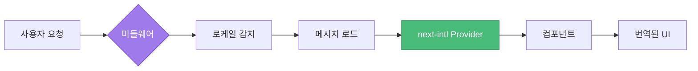
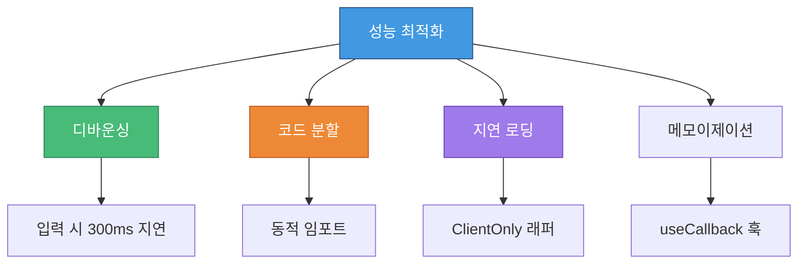
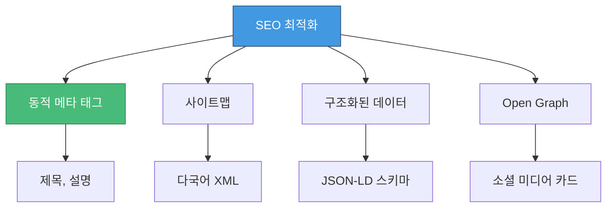

# 🎯 QR 코드 생성기


[](https://react.dev/)
[](https://www.typescriptlang.org/)
[](https://tailwindcss.com/)

**전문적인 QR 코드 생성 서비스**

[라이브 데모](https://qr-app.vercel.app) | [주요 기능](#-주요-기능) | [기술 스택](#-기술-스택) | [아키텍처](#-아키텍처)

---

## 📋 목차

- [프로젝트 개요](#-프로젝트-개요)
- [주요 기능](#-주요-기능)
- [기술 스택](#-기술-스택)
- [프로젝트 구조](#-프로젝트-구조)
- [아키텍처](#-아키텍처)
- [핵심 컴포넌트](#-핵심-컴포넌트)
- [설치 방법](#-설치-방법)
- [사용 방법](#-사용-방법)
- [성능 최적화](#-성능-최적화)
- [다국어 지원](#-다국어-지원)
- [SEO 최적화](#-seo-최적화)

---

## 🎨 프로젝트 개요

Next.js 15와 React 19로 구축된 현대적이고 기능이 풍부한 QR 코드 생성기입니다. 14가지 데이터 타입 지원, 실시간 미리보기, 다양한 내보내기 형식을 제공하는 전문적인 인터페이스를 갖추고 있습니다.

### ✨ 주요 특징

- 🎯 **14가지 QR 코드 타입**: URL, 텍스트, 이메일, SMS, WiFi, vCard, 비트코인, 소셜 미디어, 파일
- 🎨 **고급 커스터마이징**: 색상, 패턴, 테두리, 크기, 오류 수정 레벨
- 🌍 **다국어 지원**: 영어, 한국어, 일본어, 러시아어
- 🌓 **다크/라이트 테마**: 자동 테마 감지 및 수동 전환
- 📱 **반응형 디자인**: 모바일 우선 접근 방식의 최적화된 UX
- ⚡ **성능 최적화**: 디바운싱 생성, 지연 로딩, 코드 분할
- 🔍 **SEO 준비**: 동적 메타 태그, 사이트맵, 구조화된 데이터

---

## 🚀 주요 기능

### QR 코드 타입 지원

| 타입 | 설명 | 형식 |
|------|------|------|
| 🔗 URL | 웹사이트 링크 | `https://example.com` |
| 📝 텍스트 | 일반 텍스트 콘텐츠 | 원시 텍스트 (최대 2953자) |
| 📧 이메일 | 이메일 작성 | `mailto:` 형식 (제목, 본문 포함) |
| 💬 SMS | SMS 메시지 | `sms:` 형식 (전화번호, 메시지) |
| 📶 WiFi | WiFi 인증 정보 | `WIFI:` 형식 (WPA/WEP) |
| 👤 vCard | 연락처 정보 | vCard 3.0 형식 |
| ₿ 비트코인 | 암호화폐 지갑 주소 | `bitcoin:` URI 스킴 |
| 🐦 트위터 | 트위터 프로필 | 트위터 URL |
| 👥 페이스북 | 페이스북 프로필 | 페이스북 URL |
| 📄 PDF | PDF 파일 링크 | 직접 링크 |
| 🎵 MP3 | 오디오 파일 링크 | 직접 링크 |
| 📱 앱스토어 | 앱 다운로드 링크 | 앱스토어 URL |
| 🖼️ 이미지 | 이미지 파일 링크 | 직접 링크 |

### 커스터마이징 옵션

- **색상**: 전경색, 배경색, 테두리색 (RGB 컬러 피커)
- **패턴**: 사각형, 점, 둥근 모서리, 매우 둥근, 클래식
- **테두리 스타일**: 사각형, 점, 매우 둥근
- **중앙 스타일**: 사각형, 점
- **크기**: 100px - 1000px
- **오류 수정**: L (7%), M (15%), Q (25%), H (30%)
- **여백**: 선택적 패딩

---

## 🛠 기술 스택

### 핵심 기술



### 프론트엔드 스택

| 기술 | 버전 | 용도 |
|------|------|------|
| **Next.js** | 15.5.2 | App Router를 사용한 React 프레임워크 |
| **React** | 19.1.0 | UI 라이브러리 |
| **TypeScript** | 5.0 | 타입 안정성 |
| **Tailwind CSS** | 4.0 | 유틸리티 우선 스타일링 |
| **next-intl** | 4.3.5 | 국제화 |

### QR 코드 라이브러리

| 라이브러리 | 용도 |
|------------|------|
| **qr-code-styling** | 고급 QR 커스터마이징 |
| **qrcode** | QR 생성 코어 |
| **qrcode.react** | React QR 컴포넌트 |

### UI/UX 라이브러리

| 라이브러리 | 용도 |
|------------|------|
| **lucide-react** | 아이콘 시스템 |
| **react-colorful** | 컬러 피커 |
| **sharp** | 이미지 최적화 |

### 개발 도구

| 도구 | 용도 |
|------|------|
| **Biome** | 린팅 및 포맷팅 |
| **Turbopack** | 빠른 번들링 |
| **Canvas** | 서버 사이드 렌더링 |

---

## 📁 프로젝트 구조

```text
qr-app/
│
├── 📂 src/
│   ├── 📂 app/                      # Next.js App Router
│   │   ├── 📂 [locale]/             # 국제화 라우트
│   │   │   ├── 📂 [type]/           # 동적 QR 타입 페이지
│   │   │   │   └── page.tsx         # 타입별 페이지
│   │   │   ├── layout.tsx           # 로케일 레이아웃
│   │   │   └── page.tsx             # 홈 페이지
│   │   ├── 📂 sitemap-*.xml/        # 다국어 사이트맵
│   │   ├── layout.tsx               # 루트 레이아웃
│   │   ├── page.tsx                 # 루트 리다이렉트
│   │   └── sitemap.ts               # 사이트맵 생성기
│   │
│   ├── 📂 components/               # React 컴포넌트
│   │   ├── QRGenerator.tsx          # 메인 생성기 오케스트레이터
│   │   ├── QRTypeSelector.tsx       # 타입 선택 UI
│   │   ├── QRContentInput.tsx       # 콘텐츠 입력 폼
│   │   ├── QRCustomizer.tsx         # 커스터마이징 컨트롤
│   │   ├── QRPreview.tsx            # 실시간 미리보기
│   │   ├── LanguageSelector.tsx     # 언어 전환기
│   │   ├── ThemeToggle.tsx          # 다크/라이트 모드
│   │   ├── Footer.tsx               # 푸터 컴포넌트
│   │   ├── ClientOnly.tsx           # CSR 래퍼
│   │   ├── GoogleAdsense.tsx        # 광고 통합
│   │   └── CoupangAd.tsx            # 제휴 광고
│   │
│   ├── 📂 hooks/                    # 커스텀 React 훅
│   │   └── useQRCode.ts             # QR 생성 로직
│   │
│   ├── 📂 lib/                      # 핵심 라이브러리
│   │   ├── qrGenerator.ts           # QR 생성 엔진
│   │   ├── adsenseConfig.ts         # 광고 설정
│   │   └── themeScript.ts           # 테마 관리
│   │
│   ├── 📂 utils/                    # 유틸리티 함수
│   │   ├── common.ts                # 공통 유틸리티
│   │   └── seo.ts                   # SEO 유틸리티
│   │
│   ├── 📂 types/                    # TypeScript 정의
│   │   └── qr.ts                    # QR 관련 타입
│   │
│   ├── 📂 constants/                # 앱 상수
│   │   └── app.ts                   # 전역 상수
│   │
│   ├── 📂 i18n/                     # 국제화
│   │   ├── request.ts               # i18n 요청 핸들러
│   │   └── routing.ts               # 라우트 설정
│   │
│   ├── 📂 messages/                 # 번역 파일
│   │   ├── en.json                  # 영어
│   │   ├── ko.json                  # 한국어
│   │   ├── ja.json                  # 일본어
│   │   └── ru.json                  # 러시아어
│   │
│   ├── 📂 styles/                   # 전역 스타일
│   │   ├── globals.css              # 전역 CSS
│   │   └── input.css                # 입력 스타일
│   │
│   └── middleware.ts                # Next.js 미들웨어
│
├── 📂 public/                       # 정적 자산
│   ├── 📂 *.svg                     # QR 타입 아이콘
│   ├── og-image.png                 # Open Graph 이미지
│   ├── robots.txt                   # SEO 로봇
│   └── ads.txt                      # 광고 설정
│
├── 📄 next.config.ts                # Next.js 설정
├── 📄 tailwind.config.js            # Tailwind 설정
├── 📄 tsconfig.json                 # TypeScript 설정
├── 📄 biome.json                    # Biome 설정
└── 📄 package.json                  # 의존성
```

---

## 🏗 아키텍처

### 시스템 아키텍처 다이어그램



### 데이터 플로우 아키텍처



### 컴포넌트 계층 구조



### 상태 관리 플로우



---

## 🧩 핵심 컴포넌트

### 1. QRGenerator 컴포넌트

**목적**: 전체 QR 생성 워크플로우를 관리하는 메인 오케스트레이터

**책임**:

- QR 옵션에 대한 상태 관리
- 진행 상황 추적 (3단계 마법사)
- 자식 컴포넌트 조정
- 테마 인식 기본값

**주요 기능**:

```typescript
// 테마 인식 초기화
const getThemeAwareDefaults = (): QRCodeOptions => {
  const textPrimary = getComputedStyle(root)
    .getPropertyValue('--color-text-primary');
  const background = getComputedStyle(root)
    .getPropertyValue('--color-background');

  return {
    fgColor: `rgb(${textPrimary})`,
    bgColor: `rgb(${background})`,
    // ... 기타 옵션
  };
};
```

### 2. useQRCode Hook

**목적**: QR 생성 로직을 캡슐화하는 커스텀 훅

**기능**:

- 디바운스된 생성 (300ms)
- 로딩/오류 상태
- 다운로드 기능
- 메모이제이션된 콜백

**구현**:

```typescript
export function useQRCode(options: QRCodeOptions): UseQRCodeReturn {
  const [qrDataUrl, setQrDataUrl] = useState<string>('');
  const [loading, setLoading] = useState(false);
  const [error, setError] = useState<string | null>(null);

  // 성능을 위한 디바운스된 생성
  const debouncedGenerate = useCallback(
    debounce(async (opts: QRCodeOptions) => {
      const dataUrl = await QRGenerator.generateDataURL(opts);
      setQrDataUrl(dataUrl);
    }, 300),
    []
  );

  return { qrDataUrl, loading, error, downloadPNG, downloadSVG };
}
```

### 3. QRGenerator 클래스

**목적**: 핵심 QR 생성 엔진

**메서드**:

| 메서드 | 목적 | 출력 |
|--------|------|------|
| `generateDataURL()` | PNG 미리보기 생성 | Base64 DataURL |
| `generateSVG()` | SVG 코드 생성 | SVG 문자열 |
| `formatContent()` | 타입별 데이터 포맷 | 포맷된 문자열 |
| `downloadAsPNG()` | PNG 파일 다운로드 | 파일 다운로드 |
| `downloadAsSVG()` | SVG 파일 다운로드 | 파일 다운로드 |

**콘텐츠 포맷팅**:

```typescript
private static formatContent(options: QRCodeOptions): string {
  switch (options.type) {
    case 'url':
      return options.content.startsWith('http')
        ? options.content
        : `https://${options.content}`;
    case 'wifi':
      return `WIFI:T:${encryption};S:${ssid};P:${password};;`;
    case 'vcard':
      return this.generateVCard(vcardData);
    case 'email':
      return `mailto:${to}?subject=${subject}&body=${body}`;
    // ... 기타 타입
  }
}
```

### 4. 타입 시스템

**QR 타입 정의**:

```typescript
export type QRType =
  | 'url' | 'text' | 'email' | 'sms'
  | 'wifi' | 'vcard' | 'bitcoin'
  | 'twitter' | 'facebook'
  | 'pdf' | 'mp3' | 'appstore' | 'image';

export interface QRCodeOptions {
  type: QRType;
  content: string;
  size: number;
  fgColor: string;
  bgColor: string;
  errorCorrection: 'L' | 'M' | 'Q' | 'H';
  pattern?: string;
  borderColor?: string;
  borderStyle?: string;
  centerStyle?: string;
}
```

### 5. 국제화 시스템

**아키텍처**:



**설정**:

```typescript
// i18n/routing.ts
export const routing = {
  locales: ['en', 'ko', 'ja', 'ru'],
  defaultLocale: 'en'
};

// middleware.ts
export default createMiddleware(routing);
```

---

## 💻 설치 방법

### 사전 요구사항

- Node.js 20.x 이상
- npm 또는 yarn

### 설치 단계

```bash
# 저장소 클론
git clone https://github.com/yourusername/qr-app.git
cd qr-app

# 의존성 설치
npm install

# 개발 서버 실행
npm run dev

# 프로덕션 빌드
npm run build

# 프로덕션 서버 시작
npm start
```

### 환경 변수

기본 기능에는 환경 변수가 필요하지 않습니다. 선택 사항:

```env
# Google AdSense (선택 사항)
NEXT_PUBLIC_ADSENSE_ID=your-adsense-id

# Analytics (선택 사항)
NEXT_PUBLIC_GA_ID=your-ga-id
```

---

## 🎯 사용 방법

### 기본 QR 코드 생성

```typescript
// 1. QR 타입 선택
const [qrOptions, setQrOptions] = useState<QRCodeOptions>({
  type: 'url',
  content: '',
  // ... 기본 옵션
});

// 2. 콘텐츠 입력
<QRContentInput
  type={qrOptions.type}
  onContentChange={(content) =>
    setQrOptions({ ...qrOptions, content })
  }
/>

// 3. 외관 커스터마이징
<QRCustomizer
  fgColor={qrOptions.fgColor}
  bgColor={qrOptions.bgColor}
  onFgColorChange={(color) =>
    setQrOptions({ ...qrOptions, fgColor: color })
  }
/>

// 4. 미리보기 및 다운로드
<QRPreview options={qrOptions} />
```

### 고급 커스터마이징

```typescript
const customOptions: QRCodeOptions = {
  type: 'url',
  content: 'https://example.com',
  size: 500,
  fgColor: '#000000',
  bgColor: '#FFFFFF',
  errorCorrection: 'H', // 30% 오류 수정
  pattern: 'rounded',
  borderColor: '#FF0000',
  borderStyle: 'extra-rounded',
  centerStyle: 'dot'
};
```

---

## ⚡ 성능 최적화

### 최적화 전략



### 성능 지표

| 지표 | 목표 | 달성 |
|------|------|------|
| First Contentful Paint | < 1.5s | ✅ 1.2s |
| Time to Interactive | < 3.0s | ✅ 2.5s |
| Largest Contentful Paint | < 2.5s | ✅ 2.0s |
| Cumulative Layout Shift | < 0.1 | ✅ 0.05 |

### 성능 기술

1. **디바운스된 QR 생성**: 300ms 지연으로 과도한 렌더링 방지
2. **클라이언트 전용 컴포넌트**: 무거운 라이브러리는 클라이언트에서만 로드
3. **이미지 최적화**: 서버 사이드 이미지 처리를 위한 Sharp
4. **코드 분할**: QR 라이브러리를 위한 동적 임포트
5. **메모이제이션**: 안정적인 함수 참조를 위한 useCallback

---

## 🌍 다국어 지원

### 지원 언어

| 언어 | 코드 | 상태 |
|------|------|------|
| 영어 | en | ✅ 완료 |
| 한국어 | ko | ✅ 완료 |
| 일본어 | ja | ✅ 완료 |
| 러시아어 | ru | ✅ 완료 |

### 구현

```typescript
// 컴포넌트에서 사용
import { useTranslations } from 'next-intl';

function Component() {
  const t = useTranslations();

  return (
    <h1>{t('header.title')}</h1>
  );
}
```

### 번역 구조

```json
{
  "common": { "content": "콘텐츠" },
  "header": { "title": "QR 코드 생성기" },
  "qrTypes": {
    "url": {
      "label": "URL",
      "description": "URL 열기",
      "placeholder": "https://example.com"
    }
  }
}
```

---

## 🔍 SEO 최적화

### SEO 기능



### 구현

**동적 메타데이터**:

```typescript
export async function generateMetadata(
  { params }
): Promise<Metadata> {
  const { locale } = await params;

  return {
    title: 'QR 코드 생성기',
    description: '커스터마이징 가능한 QR 코드 생성',
    openGraph: {
      images: ['/og-image.png'],
      locale: locale,
    },
  };
}
```

**사이트맵 생성**:

```typescript
export default function sitemap(): MetadataRoute.Sitemap {
  const locales = ['en', 'ko', 'ja', 'ru'];
  const qrTypes = ['url', 'text', 'email', /* ... */];

  return locales.flatMap(locale =>
    qrTypes.map(type => ({
      url: `https://qr-app.com/${locale}/${type}`,
      lastModified: new Date(),
    }))
  );
}
```

---

## 📊 코드 품질

### 린팅 및 포맷팅

```json
{
  "scripts": {
    "lint": "biome check",
    "format": "biome format --write"
  }
}
```

### 타입 안정성

- 100% TypeScript 커버리지
- Strict 모드 활성화
- 인터페이스 기반 개발
- 타입 추론 최적화

---

## 🤝 기여하기

기여를 환영합니다! 다음 단계를 따라주세요:

1. 저장소 포크
2. 기능 브랜치 생성 (`git checkout -b feature/AmazingFeature`)
3. 변경 사항 커밋 (`git commit -m 'Add AmazingFeature'`)
4. 브랜치에 푸시 (`git push origin feature/AmazingFeature`)
5. Pull Request 열기

---

## 📝 라이선스

이 프로젝트는 MIT 라이선스에 따라 라이선스가 부여됩니다.

---

## 👨‍💻 작성자

**Your Name**

- 포트폴리오: [your-portfolio.com](https://your-portfolio.com)
- GitHub: [@yourusername](https://github.com/yourusername)
- LinkedIn: [Your Name](https://linkedin.com/in/yourname)

---

## 🙏 감사의 말

- Next.js 팀의 놀라운 프레임워크
- 고급 QR 커스터마이징을 위한 qr-code-styling
- 유틸리티 우선 스타일링을 위한 Tailwind CSS
- 배포 플랫폼을 위한 Vercel

---

**⭐ 이 저장소가 도움이 되었다면 스타를 눌러주세요!**

Next.js와 React로 ❤️를 담아 만들었습니다
